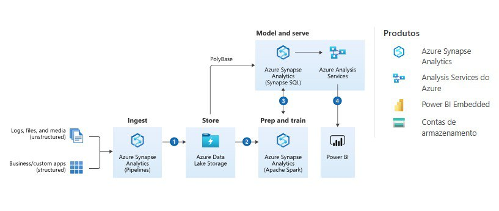

# AzureFlow: Solução Inteligente de Análise de Dados

AzureFlow é um pipeline de dados end-to-end que integra ferramentas avançadas do Azure para ingestão, armazenamento, preparação, treinamento, modelagem e visualização de dados. Ele é projetado para oferecer análises rápidas, seguras e eficazes.

---

## Descrição do Projetos

Este projeto visa automatizar o processamento e análise de grandes volumes de dados, promovendo tomadas de decisão baseadas em insights preditivos e visualizações interativas.

---

## Objetivos

- Automatizar o processamento de grandes volumes de dados.
- Integrar análises preditivas e insights em tempo real.
- Promover tomadas de decisão baseadas em dados com visualizações interativas.

---

## Principais Funcionalidades

1. **Ingestão Automatizada**: Captação de dados de diferentes fontes usando Azure Synapse Analytics.
2. **Preparação Inteligente**: Limpeza e organização de dados com Apache Spark.
3. **Modelagem Avançada**: Treinamento de modelos para previsão e análise detalhada.
4. **Visualização de Resultados**: Dashboards dinâmicos no Power BI.

---

## Tecnologias Utilizadas

- **Azure Synapse Analytics**  
- **Azure Data Lake Storage**  
- **Power BI Embedded**  
- **Azure Analysis Services**  

---

## Equipe Envolvida

- **Engenheiro de Dados**: Responsável pela arquitetura e ingestão.  
- **Cientista de Dados**: Focado em modelos preditivos e treinamento de dados.  
- **Analista de Negócios**: Apoio para análises estratégicas e de visualização.

