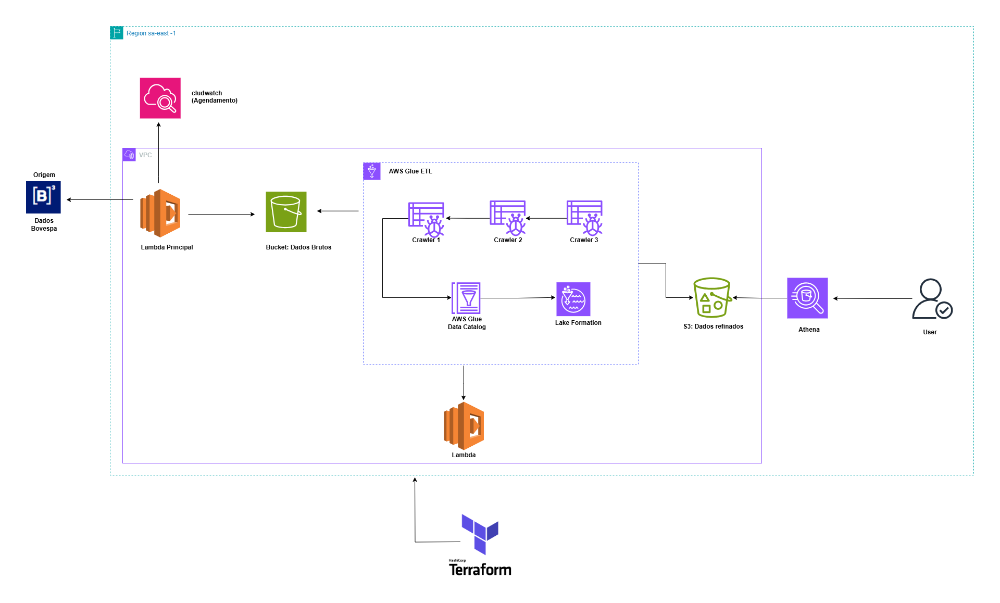

# b3_data_pepeline

- **Feature**: FEAT-2025-INT
- **Historia**:  HIST-2025-INT 
- **Operação**: Batch - ON 
- **Origem**: Base Transasional  (RT2.tbfc6_clientes) 
- **Destino**: Bases Analisticas
- **Tipo Ingestão**: 2025-Aut (Normal)

# Fluxo Integração principal

Este documento contém todas as informações necessárias para entender e usar o **B3 Data Pipeline** de forma eficiente.

#  **Documentação do Projeto: B3 Data Pipeline**

## **1. Visão Geral**
O **B3 Data Pipeline** é um projeto de ingestão, transformação e visualização de dados da B3 (Bolsa de Valores do Brasil) utilizando serviços da AWS e Power BI. Ele automatiza o fluxo de dados, garantindo eficiência na extração, armazenamento, processamento e análise.

## **2. Arquitetura do Projeto**
### **2.1. Fluxo de Dados**
1. **Fonte de Dados:**
   - Dados históricos e em tempo real da B3 (exemplo: cotações, volume de negociação, indicadores financeiros).
2. **Ingestão e Armazenamento:**
   - AWS S3 (Bucket de Dado Bruto).
   - Arquivos brutos em formatos como CSV, JSON ou Parquet.
3. **ETL - Processamento de Dados:**
   - AWS Glue para transformação e limpeza dos dados.
   - AWS Lambda para automação do pipeline.
4. **Exploração e Consulta:**
   - AWS Athena para análise SQL sobre os dados refinados.
5. **Visualização:**
   - Power BI para criação de dashboards interativos e relatórios.

---

## **3. Tecnologias Utilizadas**
| Tecnologia  | Finalidade |
|------------|-----------|
| **AWS S3** | Armazenamento dos dados brutos e refinados |
| **AWS Glue** | Transformação e limpeza de dados |
| **AWS Lambda** | Automação de processos ETL |
| **AWS Athena** | Execução de consultas SQL sobre os dados refinados |
| **Power BI** | Construção de dashboards e relatórios |

---

## **4. Estrutura dos Dados**
### **4.1. Fonte de Dados**
Os dados da B3 podem conter informações como:
- **Cotações de ações** (exemplo: PETR4, VALE3, ITUB4)
- **Volume de negociação**
- **Preço de abertura, fechamento, máxima e mínima**
- **Indicadores financeiros** (exemplo: P/L, Dividend Yield, EBITDA)

### **4.2. Estrutura do Bucket S3**
📂 `s3://b3-data-pipeline/`
- 📁 **raw/** → Dados brutos recebidos da B3
- 📁 **processed/** → Dados transformados pelo AWS Glue
- 📁 **analytics/** → Dados prontos para consulta via AWS Athena

---

## **5. Processo ETL**
### **5.1. Ingestão de Dados**
- Os dados são enviados automaticamente para o bucket S3 (`raw/`).
- Um evento no S3 pode disparar a função AWS Lambda para processar os arquivos.

### **5.2. Transformação dos Dados**
- O AWS Glue limpa, padroniza e transforma os dados brutos.
- Os arquivos refinados são salvos na pasta `processed/`.

### **5.3. Exploração e Consulta**
- O AWS Athena permite executar queries SQL diretamente no bucket S3 (`analytics/`).

---

## **6. Automação e Agendamento**
- A AWS Lambda monitora a chegada de novos arquivos e aciona o AWS Glue.
- O Glue pode rodar transformações de forma programada (exemplo: diariamente às 18h).
- O Power BI é atualizado automaticamente via conexão ao Athena.

---

## **7. Dashboards no Power BI**
Os principais indicadores disponíveis no Power BI incluem:

✅ Preço médio das ações ao longo do tempo  
✅ Volume de negociação por ativo  
✅ Comparação entre diferentes ativos  
✅ Tendências de mercado e volatilidade  

---

## **8. Segurança e Permissões**
- O acesso ao S3 será gerenciado via **IAM Policies**.
- O AWS Glue e Athena terão permissões específicas para leitura/escrita nos buckets.
- O Power BI terá acesso aos dados via **AWS Athena ODBC Connector**.

