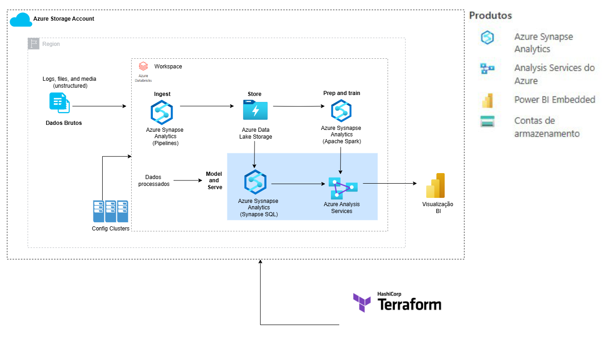

#
## 🚀 Projeto Real: Spark + Databricks + Terraform + Azure
AzureFlow é um pipeline de dados end-to-end que integra ferramentas avançadas do Azure para ingestão, armazenamento, preparação, treinamento, modelagem e visualização de dados.

## Objetivos
- Criar um pipeline completo de engenharia de dados no Azure Databricks, com infraestrutura como código (Terraform) e processamento Spark otimizado com File-Based Partitioning.
- Este projeto visa automatizar o processamento e análise de grandes volumes de dados, promovendo tomadas de decisão baseadas em insights preditivos e visualizações interativas.

# Estratégia de Particionamento Baseada em Arquivos no Spark

Uma técnica chamada **File-Based Partitioning Strategy** ou **Estratégia de Particionamento Baseada em Arquivos** é usada no Spark para dividir dados em partições com base na organização dos arquivos no armazenamento. Essa abordagem pode melhorar a leitura de dados e minimizar problemas como **data skew** (processamento desbalanceado).

---

## 🔍 Como Funciona?
- Ao ler arquivos com Spark (ex.: Parquet, CSV, JSON), cada arquivo ou bloco é tratado como uma partição física inicial.
- O Spark distribui trabalho entre os executors usando os metadados dos arquivos.

### Exemplo Prático:
- Estrutura de pastas: `/dados/*.parquet`
- Particionamento:
  - Arquivos grandes são divididos em splits (ex.: 150 MB → 2 partições de 75 MB).
  - Cada partição se transforma em uma tarefa no cluster.
- Problema: **Data skew** pode ocorrer com arquivos de tamanhos muito diferentes.

---

## 🚀 Vantagens
- **Eficiência:** Reduz operações de shuffle (os dados vêm "pré-divididos").
- **Balanceamento Automático:** Arquivos de tamanhos semelhantes distribuem bem as tarefas.
- **Integração com Formatos Colunares:** Parquet e ORC permitem ler apenas colunas necessárias.

---

## ⚙️ Casos de Uso e Configurações
### Quando Usar:
- Dados organizados em arquivos/pastas.
- Exemplos: processamento de logs, pipelines ETL incrementais, consultas filtradas por colunas.

### Configurações:
- Controle o tamanho das partições com **maxPartitionBytes**.
- Use **repartition** ou **coalesce** para ajustar o balanceamento.

---

## ⚠️ Desafios e Soluções
- **Data skew:** Tamanho de arquivos desbalanceado.
- **Muitos Arquivos Pequenos:** 10.000 arquivos de 1 MB podem ser ineficientes.
- **Soluções:** Combine arquivos pequenos e monitore o Spark UI para otimizar as partições.

---

## ✅ Resumo
| Característica         | Detalhe                                             |
|------------------------|-----------------------------------------------------|
| **Origem das Partições** | Baseada em arquivos/blocos no armazenamento.       |
| **Balanceamento**       | Depende do tamanho dos arquivos (possível skew).    |
| **Controle**            | maxPartitionBytes, repartition, coalesce.          |
| **Melhor para**         | Dados colunares (Parquet/ORC) com filtros.         |

### Dica Final:
Monitore o **Spark UI** para identificar problemas e otimizar suas partições! 🚀
