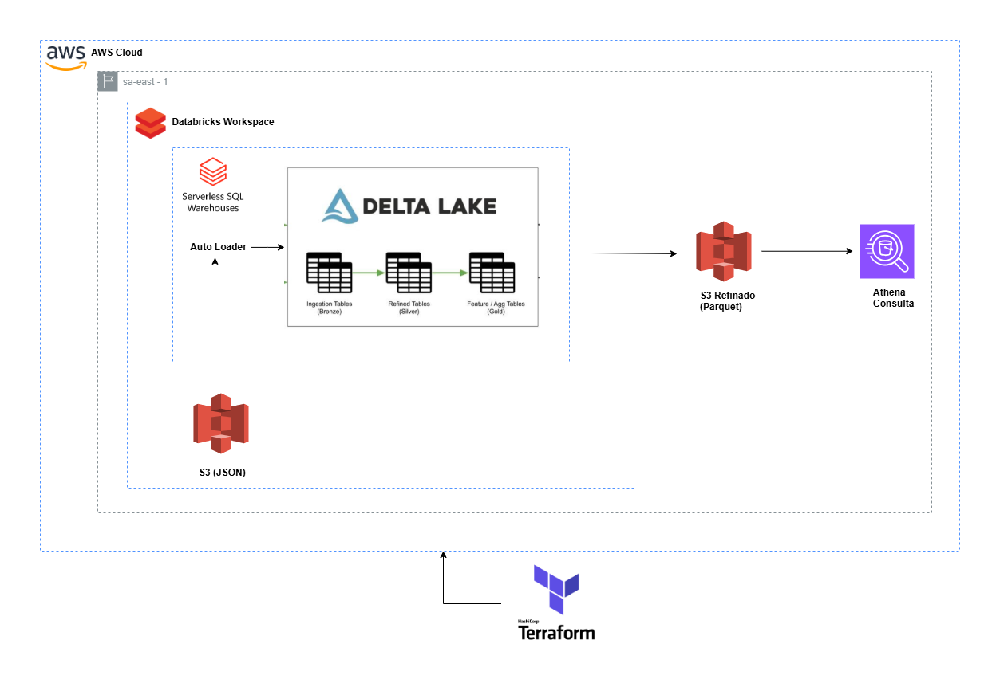

- **Feature**: FEAT-2025-INT
- **Historia**:  HIST-2025-INT 
- **Operação**: Batch - ON 
- **Origem**: Base Transasional  (RT2.tbfc6_clientes) 
- **Destino**: Bases Analisticas
- **Tipo Ingestão**: 2025-Aut (Normal)
- **Ponto Focal**: Fernando Wellington A. Amaral

# Lakehouse360

## Visão Geral

Este documento descreve uma arquitetura de processamento de dados utilizando os serviços AWS, Databricks e Terraform. A estrutura é projetada para ingerir, refinar e analisar dados de forma eficiente, com uma abordagem modular baseada em camadas.

## Componentes Principais

### **AWS Cloud**
- Ambiente de nuvem onde os serviços e recursos são executados.
- Região especificada: `sa-east-1`.

### **Databricks Workspace**
- Espaço de trabalho para processamento de dados.
- Utilizado para organizar e executar workflows baseados em Delta Lake.

### **Serverless SQL Warehouses**
- Armazéns de SQL sem servidor que facilitam consultas SQL diretas.
- Permite análise avançada e integração simplificada com ferramentas externas.

### **Delta Lake**
Estratégia de armazenamento em camadas:
1. **Bronze**: Tabelas de ingestão contendo dados brutos.
2. **Silver**: Tabelas refinadas com dados transformados e validados.
3. **Gold**: Tabelas agregadas e preparadas para análise avançada e modelagem.

### **Auto Loader**
- Automatiza a ingestão de dados.
- Configurado para ler arquivos JSON diretamente do Amazon S3 e carregar os dados na camada Bronze.

### **Amazon S3**
- **JSON**: Armazenamento inicial dos dados brutos.
- **Parquet**: Armazenamento dos dados refinados em formato otimizado.

### **Athena**
- Serviço de consulta utilizado para analisar dados refinados armazenados no Amazon S3.

### **Terraform**
- Ferramenta de infraestrutura como código para provisionamento dos recursos na AWS.
- Garante escalabilidade e consistência da arquitetura.

## Fluxo de Trabalho

1. Dados são ingeridos no formato JSON no Amazon S3.
2. **Auto Loader** carrega os dados para tabelas Bronze no Delta Lake.
3. Dados são refinados e armazenados no Amazon S3 em formato Parquet.
4. Consultas SQL são feitas usando Serverless SQL Warehouses e Amazon Athena.

## Benefícios da Arquitetura

- **Escalabilidade**: Uso de AWS e Databricks permite lidar com grandes volumes de dados.
- **Modularidade**: Camadas de armazenamento (Bronze, Silver, Gold) facilitam o gerenciamento e processamento.
- **Automação**: Auto Loader e Terraform otimizam o fluxo de trabalho e reduzem intervenção manual.

## Conclusão

Esta arquitetura demonstra uma abordagem moderna e eficiente para processamento de dados em nuvem, oferecendo flexibilidade, performance e organização. É ideal para empresas que precisam gerenciar dados em larga escala e realizar análises avançadas.

